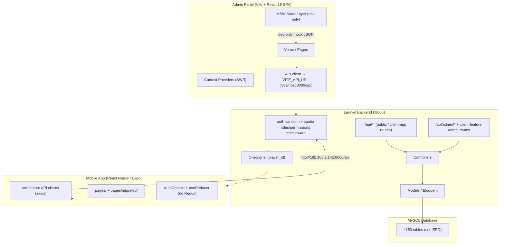
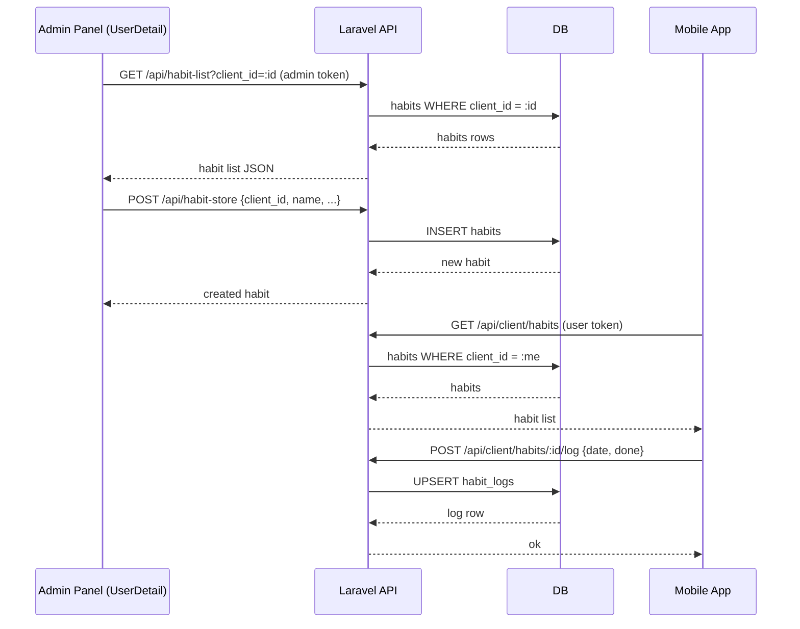
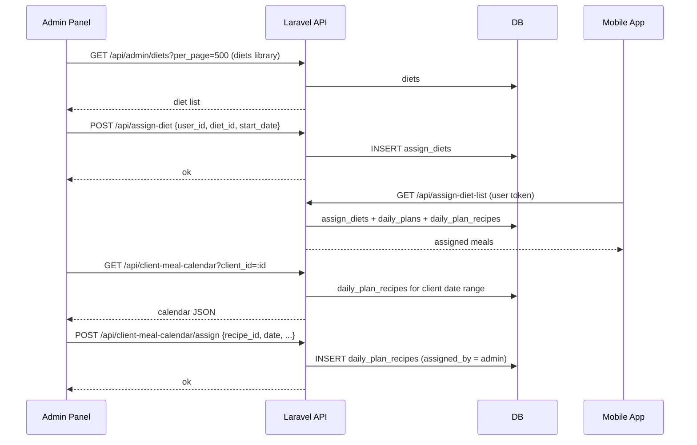
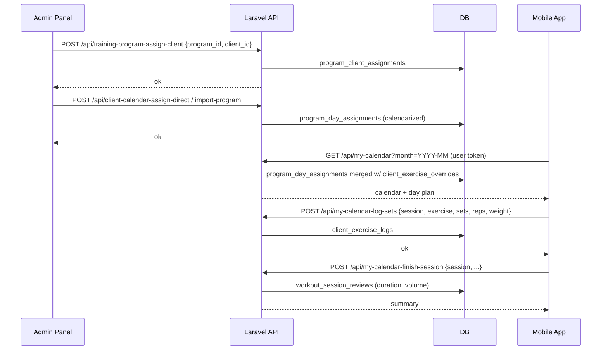
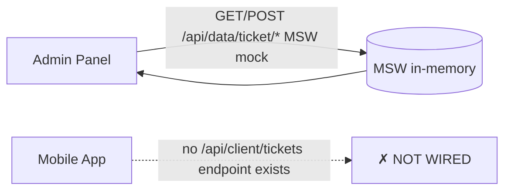

# BeFit — Backend + Mobile App Analysis

Deliverables: Entity-Relationship Diagram (ERD), Client-Server Architecture Diagram, Data-Flow Diagram, and Gap Analysis.

## 1. Entity-Relationship Diagram (ERD)

Scope: Laravel backend schema (`fitness-backend/database/migrations`, ~150 migrations) plus `fitness_backend.sql` dump (120+ tables). Grouped by domain. Mermaid `erDiagram` syntax.

```mermaid
erDiagram
    %% ================= CORE / AUTH =================
    users {
        bigint id PK
        string name
        string email UK
        string password
        bigint coach_id FK
        boolean is_personal_client
        string timezone
        timestamp last_active_at
    }
    user_profiles {
        bigint user_id PK, FK
        string gender
        date date_of_birth
        string profile_image
        float height_cm
        float weight_kg
    }
    roles }o--o{ users : "model_has_roles"
    permissions }o--o{ roles : "role_has_permissions"
    personal_access_tokens {
        bigint tokenable_id FK
        string tokenable_type
    }
    admin_login_history }o--|| users : "admin"
    admin_login_devices }o--|| users : "admin"

    %% ================= CONTENT: DIETS & RECIPES =================
    category_diets ||--o{ diets : "categorizes"
    diets ||--o{ user_favourite_diets : "favourited_by"
    users ||--o{ user_favourite_diets : "owns"
    diets ||--o{ assign_diets : "assigned_to"
    users ||--o{ assign_diets : "receives"
    diets ||--o{ diet_meal_items : "contains"
    meal_plan_templates ||--o{ meal_plan_template_items : "groups"
    meal_plan_template_items }o--o| recipes : "references"
    recipe_categories }o--o{ recipes : "recipe_category_mappings"
    recipe_tags }o--o{ recipes : "recipe_tag_mappings"
    recipes ||--o{ recipe_ingredients : "uses"
    ingredients }o--o{ recipes : "through_recipe_ingredients"
    ingredient_categories ||--o{ ingredients : "categorizes"
    measurement_units ||--o{ ingredient_unit_conversions : "unit_of"
    recipes ||--o{ recipe_steps : "steps"
    recipes ||--o{ recipe_reviews : "reviewed_by"
    users ||--o{ recipe_reviews : "writes"
    recipes ||--o{ user_favourite_recipes : "favourited_by"
    daily_plans ||--o{ daily_plan_recipes : "meal_entries"
    daily_plan_recipes }o--o| recipes : "meal"
    daily_plan_recipes }o--o| users : "assigned_to (client)"
    daily_plan_recipes }o--o| users : "assigned_by (coach)"

    %% ================= CONTENT: WORKOUTS / TRAINING =================
    categories ||--o{ workouts : "categorizes"
    levels ||--o{ workouts : "difficulty"
    workout_types ||--o{ workouts : "type"
    tags }o--o{ workouts : "tags"
    equipment ||--o{ exercises : "requires"
    body_parts ||--o{ exercises : "targets"
    exercises ||--o{ workouts : "via_workout_day_exercises"
    workouts ||--o{ workout_days : "days"
    workout_days ||--o{ workout_day_blocks : "blocks"
    workout_days ||--o{ workout_day_exercises : "contains"
    workout_day_exercises }o--o| exercises : "exercise"
    workout_day_exercises }o--o| metrics_catalog : "enabled_metrics"
    users ||--o{ user_favourite_workouts : "owns"
    workouts ||--o{ user_favourite_workouts : "favourited"
    users ||--o{ user_exercises : "personal_library"
    user_exercises }o--o| exercises : "copy_of"

    workout_templates ||--o{ workout_template_blocks : "blocks"
    workout_templates ||--o{ workout_template_exercises : "exercises"
    workout_template_exercises }o--o| exercises : "exercise"
    section_templates ||--o{ section_template_exercises : "contains"
    workout_templates }o--o{ section_templates : "imports"
    users ||--o{ user_favourite_workout_templates : "owns"

    %% ================= ASSIGNMENT & CALENDAR =================
    assign_workouts }o--o| users : "assigned_to"
    assign_workouts }o--o| workouts : "assigned_workout"
    training_programs }o--o| users : "client_assignee"
    training_programs }o--o| users : "coach_owner"
    training_programs ||--o{ program_day_assignments : "scheduled_days"
    program_day_assignments }o--o| workout_days : "day"
    program_day_assignments }o--o| users : "source_subscription"
    program_client_assignments }o--o| users : "assignee"
    workout_session_reviews }o--o| program_day_assignments : "session"
    client_exercise_logs }o--o| exercises : "exercise"
    client_exercise_logs }o--o| program_day_assignments : "session"
    client_exercise_overrides }o--o| program_day_assignments : "session"
    client_exercise_overrides }o--o| workout_template_exercises : "override_target"

    %% ================= COACHING: CLIENT FILES =================
    users ||--o{ client_goals : "goals"
    users ||--o{ client_limitations : "limitations"
    users ||--o{ client_body_metrics : "body_metrics"
    users ||--o{ client_notes : "notes"
    users ||--o{ client_exercise_feedback : "feedback"
    users ||--o{ tasks : "tasks"
    users ||--o{ personal_records : "records"
    users ||--o{ habits : "habits"
    habits ||--o{ habit_logs : "logs"
    users ||--o{ client_feature_settings : "settings"
    client_tags }o--o{ users : "tagged"

    %% ================= FORMS =================
    forms ||--o{ form_questions : "questions"
    forms ||--o{ form_assignments : "assigned_to"
    forms ||--o{ form_submissions : "submissions"
    form_assignments }o--o| users : "client"
    form_submissions ||--o{ form_answers : "answers"
    form_answers }o--o| form_questions : "question"

    %% ================= COMMUNITY =================
    users ||--o{ postings : "author"
    postings ||--o{ posting_likes : "likes"
    postings ||--o{ posting_bookmarks : "bookmarks"
    postings ||--o{ report_postings : "reports"
    postings ||--o{ comments : "comments"
    comments ||--o{ comment_replies : "replies"
    posts ||--o{ blog_categories : "blog_category"

    %% ================= COMMERCE / SUBSCRIPTIONS =================
    users ||--o{ subscriptions : "subscriber"
    packages ||--o{ subscriptions : "package"
    users ||--o{ personal_client_invites : "invites"
    payment_gateways ||--o{ subscriptions : "gateway"

    %% ================= GAMIFICATION / MISC =================
    users ||--o{ user_graphs : "weight_graph"
    users ||--o{ challenge_scores : "challenge"
    challenges ||--o{ challenge_scores : "scores"
    users ||--o{ daily_water_goals : "water"
    users ||--o{ daily_steps_goals : "steps"
    users ||--o{ push_notifications : "device_push"
    shopping_lists ||--o{ shopping_list_items : "items"
    users ||--o{ shopping_lists : "owner"
```

---

## 2. Client-Server Architecture Diagram

Key facts:
- Admin panel is a **pure client-side SPA**; its "API" calls hit the Laravel API at `VITE_API_URL || 'http://localhost:8000/api'`. In dev, MSW mocks intercept when the backend isn't running.
- Mobile app is **Expo RN** with `API_BASE_URL=http://192.168.1.145:8000/api`, per-feature axios clients (`api/auth.ts`, `api/diet.ts`, `api/workouts.ts`, `api/recipes.ts`, …), no global state library — `AuthContext` + `useReducer`.
- Auth: Sanctum bearer tokens. Admin panel uses admin credentials + role checks; app uses a client/user token.
- Community, subscriptions, products, notifications (OneSignal), game scores are all wired in the backend and app.

---

## 3. Data-Flow Diagram (per feature)

### 3.1 Habits (newest — admin + client, fully wired)

### 3.2 Nutrition — Assigned Diets + Client Meal Calendar

### 3.3 Training — Programs / Calendar / Session logging

### 3.4 Tickets — NOT CONNECTED

Tickets exist **only** as admin-side MSW mocks. There is no Laravel tickets controller/model/migration and no mobile-app screen. End-to-end gap.

---

## 4. Gap Analysis

### 4.1 Fully implemented (admin → DB → mobile app)

| Feature | Admin panel | Laravel backend | Mobile app |
|---|---|---|---|
| Auth / register / login | ✓ | ✓ Sanctum | ✓ |
| Diets + recipes + meal calendar | ✓ (diets list, assign diet) | ✓ diets, daily_plans, recipes, calendar | ✓ DietList/Dashboard, assigned meals |
| Workouts / exercises / templates | ✓ | ✓ workouts, templates, programs | ✓ WorkoutList/Detail/Template |
| Training programs + calendar | ✓ (program-calendar, client-calendar) | ✓ | ✓ my-calendar, session logging |
| Habits | ✓ CRUD (UserDetail + Habits page) | ✓ habits, habit_logs | ✓ /api/client/habits |
| Body metrics | ✓ (body-metric charts) | ✓ client_body_metrics | ✓ progress screens |
| Community feed | ✓ (MSW only) | ✓ postings/comments/likes/bookmarks | ✓ CommunityFeed |
| Subscriptions / packages | ✓ (MSW) | ✓ packages, subscriptions | ✓ subscribe screens |
| Forms (assign/answer) | ✓ (admin-form-*) | ✓ forms, questions, submissions | ✓ form-assigned-list |
| Water / steps goals | — | ✓ daily_water/steps_goals | ✓ tracker screens |
| Progress photos / notes / tasks | ✓ | ✓ | — (not surfaced) |
| Challenges / leaderboard | ✓ | ✓ challenges, scores | ✓ Challenges |

### 4.2 Admin-only or backend-only (mobile gap)

- **Client goals / limitations / tags / notes / progress photos** — backend + admin panel complete, but no mobile screens fetch them.
- **Meal plan templates** (`meal-plan-templates`) — admin only; app only sees resulting daily_plan_recipes.
- **Shopping lists** — backend + app wired; admin panel has no screen.
- **Game score / class schedules / chatbot / language keywords** — backend + app; admin panel lacks admin screens (community MSW mocks only).
- **Products** — admin MSW mock only; backend has real `products` endpoints and app `api/products.ts`.

### 4.3 Not connected / missing entirely

| Item | Where it stops | What's missing |
|---|---|---|
| **Tickets** | Admin panel MSW only | Backend model/table + `/api/client/tickets*` + app screen |
| **Push notifications** | Backend (OneSignal `player_id`) | No admin panel management UI |
| **Blog** | Admin panel MSW + backend `posts`/`blog_categories` | App screens? (migrated blog_screen exists) |
| **Real endpoints for admin MSW mocks** | MSW intercepts in dev | Many admin pages (products, tickets, blog) never hit Laravel |

### 4.4 Notable schema oddities / legacy

- **Duplicate route names**: `assign-diet-list`, `assign-workout-list`, `user-daily-water-goal-list`, `user-daily-steps-goal-list`, `workoutday-exercise-list`, `exercise-detail`, `workout-template-*`, `metric-list` are registered twice (V1 + older controller) — last match wins in Laravel.
- **`game_score_data`, `push_notifications`, `settings`, `app_settings`** overlap conceptually; several legacy tables (`old-mightyfitness.sql`) not represented in migrations.
- `users.coach_id`, `users.is_personal_client`, `users.last_active_at` were added later (2026-07) — personal-coach model is the newest addition.
